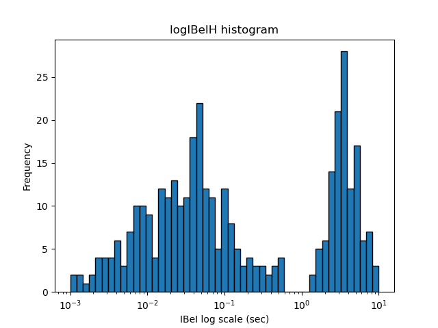
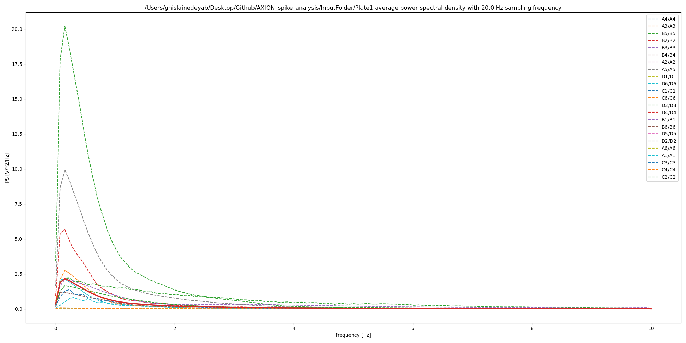
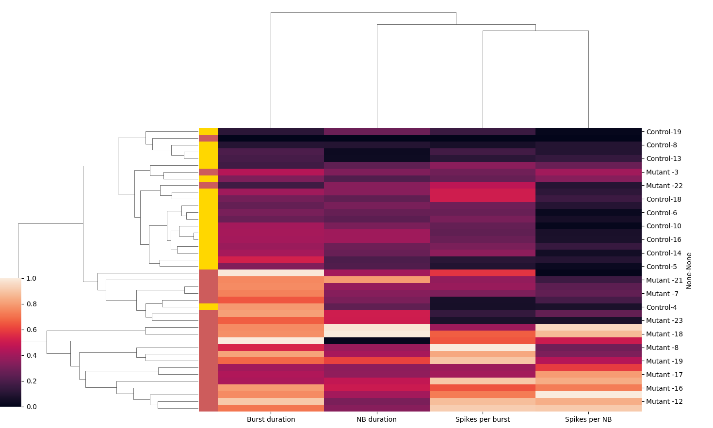

# AXION_spike_analysis
Python workflow to analyse multi electrode array recording from AXION biosystems and create visualization
Data visualization and analyysis tools for MEA data of 2D and 3D cell cultures

## Installation:
Dependencies:
- python 3.6+
- seaborn 0.11.1
- pandas 1.1.0+

To install seaborn:
```
$ pip install seaborn
```

Seaborn is also included in the Anaconda distribution:
```
$ conda install seaborn
```
Clone the repository:
```
$ git clone https://github.com/RhalenaThomas/AXION_spike_analysis.git
```
Example data from data collected on 2 MEA plates can be found in InputFolder

Example of processed data including all output can be found in InputFolder_with_Analysis_Output

## Data sorting
To preprocess the spike train data of all wells on a Axion MEA plate given by the spike_list.csv file generated by Axion Biosystems software and generate separate spikes.csv files for every well on the plate (saved as WellNumber_spikes.csv e.x A1_spikes.csv), 

1. From the Main_analysis folder of the cloned directory, run the Step1_SpikeSort.py bash script with the input folder containing all spike_list.csv files exported from Axion Biosystems as the first command line argument (should have one spike_list.csv file per MEA plate recorded), all spike_list.csv files should be placed in subfolders under one parent folder (see InputFolder as an example).

```
$ python Step1_SpikeSort.py path_to_InputFolder
```
Prompt will appear to indicate which electrodes/wells you would like to skip (in the case that an electrode has no neurons/tissue on it), if none press enter.
e.x Exclude electrodes for file InputFolder name_of_spike_list.csv (format example: A1_11,A1_34,A3_13):

The output will produce a sub-folder in the initial InputFolder with sorted spike lists for each well denoted as WellNumber_spikes.csv (e.x A1_spikes.csv).

## Burst analysis + inter event interval histogram plotting

### Burst detection using the ISI threshold method + logISI histogram:

Detect electrode burst for a well using the ISI threshold method, with the minimum number of spikes allowed in a burst set to 5 and the maximum inter spike interval allowed in a burst set to 0.1 sec. Also computes the histogram of logISIs for each well.

Output: a bursts.csv file and a log_ISI.png file for every spikes.csv input file

N.B.: Step1_SpikeSort.py must be run on data before running this script

From the Main_analysis folder of the cloned directory:

1. Run the Step2_BurstDetection.py script on the parent InputFolder

```
$ python Step2_BurstDetection.py path_to_InputFolder
```
#### Example output:


## Network burst analysis + inter burst interval histogram plotting

### Network burst detection using the adaptive threshold method + logIBeI histogram:
Detect network burst for a well using the ISI threshold method (see relevant readings below), with the minimum percent of spikes allowed in a burst set to 0.1875 (3 electrodes) out of 16 total electrodes. Also computes the histogram of logIBeIs for each well. 

N.B.: Step2_BurstDetection.py must be run on data before running this script

Output: a histogram of log inter burst event intervals saved as a log_IBeIH.png file and a networkBursts.csv file for every burst_list.csv input file.

1. Run the Step3_NetworkburstDetection.py script on the parent InputFolder
```
$ python Step3_NetworkburstDetection.py path_to_InputFolder
```
### Example output:


## Raster plot visualization

### Raster plots + histograms of spike count per 1 second bin
Plots a raster plot of spike train data for every well, along with a histogram of spike counts per 1 second interval. If available, will also plot the burst and network burst information for every well. To get burst and network burst information, run Step2_BurstDetection.py and Step3_NetworkburstDetection.py on data before running Step4_RasterPlot.py

1. To run the Step4_RasterPlot.py script on the InputFolder containing all output from Step1, Step2, and Step3 : 
```
$ python Step4_RasterPlot.py path_to_InputFolder
```
Here spikes within bursting period are highlighted in blue, and network bursts are outlined producing vertical black lines

#### Example output:


## Supplemental Graphs

From the Supplementary_Graphs folder of the cloned directory 

### Power spectral density plots
Plots the power spectral density from the spike train data of a well. Bin size (1/sampling frequency) is by default 0.0005 sec.

1. Run the power_spectrum.py script on all spikes.csv files inside some $InputFolder: 
```
$ python power_spectrum.py path_to_InputFolder
```

#### Example output with bin size=0.05:

### Mean power spectral density plots
Plots the averaged power spectral density for a set of wells. Bin size (1/sampling frequency) can be provided as the second command line argument, default bin size is 0.0005 sec.

1. Run the power_spectrum_mean.py script with the filepath to the input folder containting the spikes.csv files to be averaged as the first argument, and the bin size as the second argument. 

Requires pooling of spikes.csv files for wells to be included in analysis from Step1_SpikeSort.py output 

For example:
```
$ python power_spectrum_mean.py path_to_InputFolder 0.05
```
#### Example output with bin size=0.05:



### Clustering analysis
Uses excel file with average parameters from all wells in a given plate. Input file must be a xlsx sheet with the same format as Extracted-Parameters.xlsx. The extracted parameters columns can be changed to reflect parameters of interest. Average parameters can be extracted from the Axion Biosystems Neural Metric Tool. 


### Hierarchical clustering
Generate hierarchically clustered heatmaps showing how different cell plates or cell lines are clustered based on their electrophysiological activity. Heatmaps are generated from custom excel file summarizing data across wells for selected parameters extracted from Axion Biosystems Neural Metric Tool(see Extracted_Parameters.xlsx file as example).

Excel sheet name needs to be specified in hierarchical.py script:
e.x. data = pd.read_excel(inputFile, sheet_name="Example Data", header=4, index_col=[0,1], skiprows=[5,])

Column names for chosen parameters need to be specified in the hierarchical.py script
e.x. data_to_clus = data[['NB duration', 'Burst duration', 'Spikes per burst', 'Spikes per NB' ]]

1. From the Supplementary_Graphs folder inside the cloned directory, run the hierarchical.py script with the filepath to the input file as an argument. For example:
```
$ python hierarchical.py Extracted-Parameters.xlsx
``` 

#### Output:
The plot will be saved in the cloned directory under hierarchical.png



## Others
`AXION_spike_analysis` contains spikesort.sh, a bash script version of spike_sort.py, and spike_filefinder.sh, for finding spikes.csv files and executing another script on every file found.

`AXION_spike_analysis\Supplementary_Graphs\kmeans` performs k means clustering on an Extracted-Parameters.xlsx file, similar to the hierarchical clustering script.

`AXION_spike_analysis\Main_analysis\drafts` contains spike_histogram.py, which plots a histogram of logISIs for an input spikes.csv file, and power_spectrum_axion.py, which plots a grid of power spectrums for every organoid in the spike_counts.csv outputted by Axion software.


## Relevant readings:

- M. Chiappalone, A. Novellino, I. Vajda, A. Vato, S. Martinoia, J. van Pelt. Burst detection algorithms for the analysis of spatio-temporal patterns in cortical networks of neurons. Neurocomputing. https://doi.org/10.1016/j.neucom.2004.10.094. 

- Cotterill E, Charlesworth P, Thomas CW, Paulsen O, Eglen SJ. A comparison of computational methods for detecting bursts in neuronal spike trains and their application to human stem cell-derived neuronal networks. J Neurophysiol. 2016 Aug 1;116(2):306-21. doi: 10.1152/jn.00093.2016. Epub 2016 Apr 20. PMID: 27098024; PMCID: PMC4969396. 

- Cotterill E, Eglen SJ. Burst Detection Methods. Adv Neurobiol. 2019;22:185-206. doi: 10.1007/978-3-030-11135-9_8. PMID: 31073937. 

- Pasquale V, Martinoia S, Chiappalone M. A self-adapting approach for the detection of bursts and network bursts in neuronal cultures. J Comput Neurosci. 2010 Aug;29(1-2):213-229. doi: 10.1007/s10827-009-0175-1. Epub 2009 Aug 8. PMID: 19669401. 
